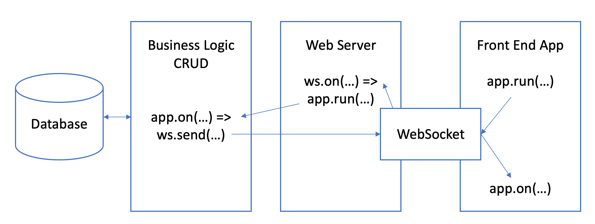
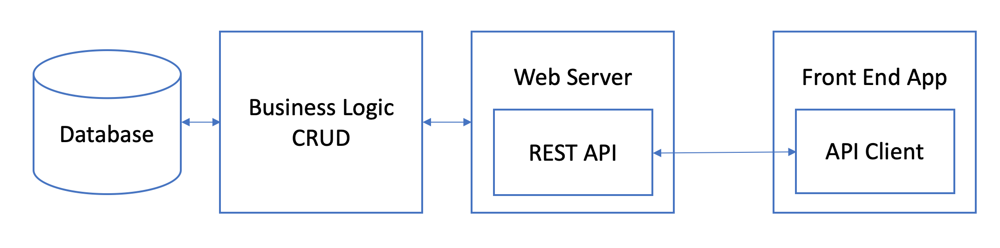

## AppRun - WebSockets - SQLite

Most of the database-driven applications have a REST API based architecture. It is tedious and error-prone to build and then consume the REST API.

This project introduces a new architecture using the [WebSocket API](https://developer.mozilla.org/en-US/docs/Web/API/WebSockets_API) and [AppRun](https://github.com/yysun/apprun) event system.

* The front-end app is AppRun event-driven without REST API calls. In fact, it has not even network calls.

* The back-end app is also AppRun event-driven without REST API endpoints.

**No more REST API**

## DEMO

 

### Run the Project

* Use _npm start_ to start the dev server
* Use _npm run build_ to build for production

This is an application built with [AppRun](https://github.com/yysun/apprun).